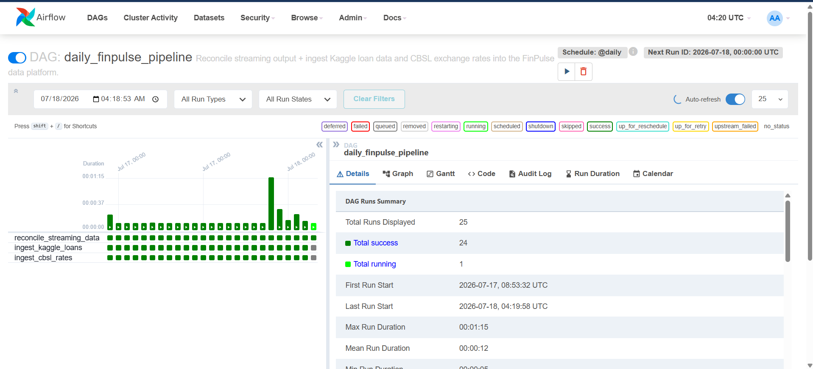
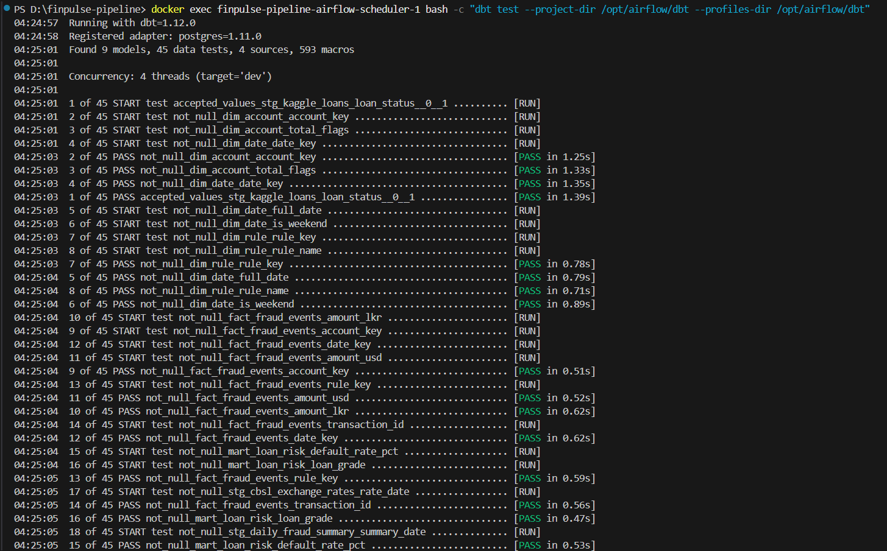
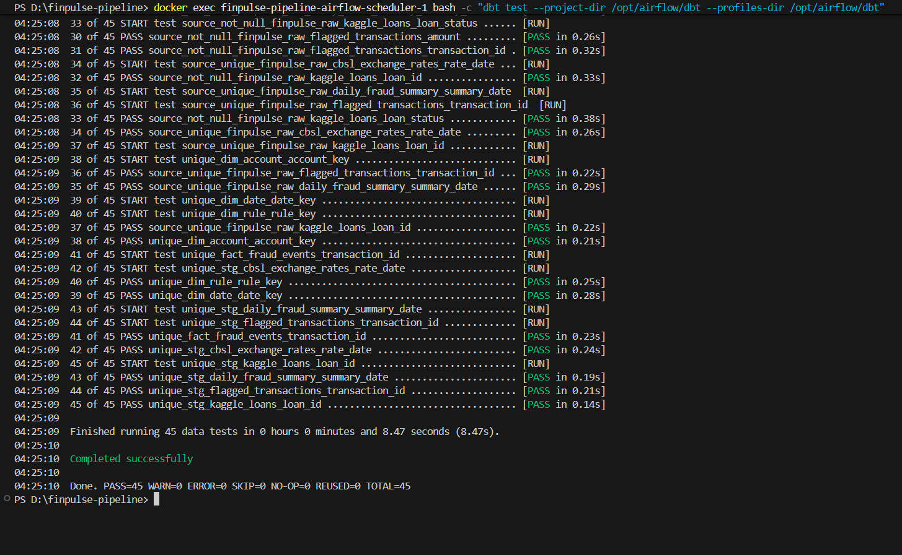
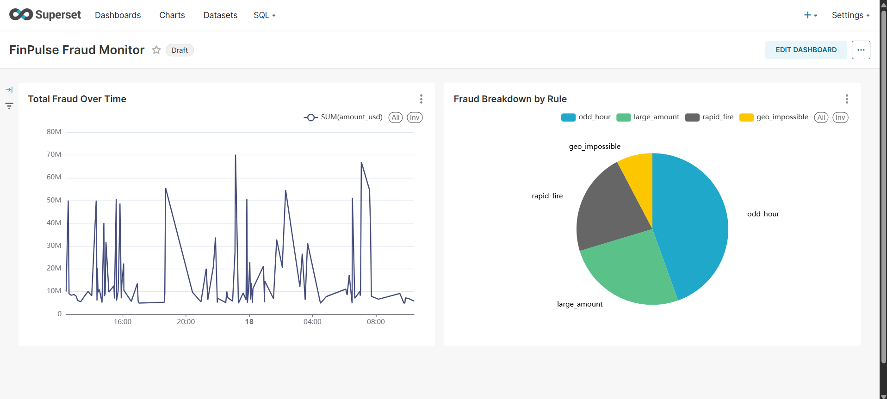

# FinPulse 🌊 


**FinPulse** is an end-to-end data engineering pipeline built to demonstrate the **Kappa Architecture**. It seamlessly processes high-volume simulated banking transactions for real-time fraud detection, archives data to a lake, reconciles it using daily batch jobs, and serves analytics through a highly optimized star schema.

---

## 🏗️ Architecture Overview

The pipeline utilizes a hybrid streaming and batch approach:

```mermaid
flowchart LR
    %% Colors and Styles
    classDef generator fill:#f9f9f9,stroke:#333,stroke-width:2px;
    classDef stream fill:#ff9900,stroke:#333,stroke-width:2px,color:#fff;
    classDef storage fill:#336791,stroke:#333,stroke-width:2px,color:#fff;
    classDef orchestration fill:#017CEE,stroke:#333,stroke-width:2px,color:#fff;
    classDef analytics fill:#00A699,stroke:#333,stroke-width:2px,color:#fff;
    
    %% Nodes
    A[Data Generator<br>Python / PaySim]:::generator
    B[(Apache Kafka<br>Message Broker)]:::stream
    C[Apache Spark<br>Structured Streaming]:::stream
    D[(MinIO<br>S3 Data Lake)]:::storage
    E[(PostgreSQL<br>Raw/Serving DB)]:::storage
    F[Apache Airflow<br>Batch Orchestrator]:::orchestration
    G[dbt<br>Star Schema]:::analytics
    H[Apache Superset<br>BI Dashboard]:::analytics
    
    %% Relationships
    A -- JSON Events --> B
    B -- Consume --> C
    
    C -- "Hot Path (Fraud Flags)" --> E
    C -- "Cold Path (Parquet)" --> D
    
    D -. "Daily Reconciliation" .-> F
    F -. "Reference Data / Aggregations" .-> E
    
    E -- "Transform" --> G
    G -- "Dimensional Model" --> E
    
    E -- "Live Query" --> H
```



---

## 🛠️ Technology Stack

| Component | Technology | Why it was chosen |
| :--- | :--- | :--- |
| **Event Streaming** | **Apache Kafka** | Handles high-throughput, fault-tolerant ingestion of simulated transactions. |
| **Stream Processing** | **Apache Spark** | Micro-batch structured streaming processes events, applies windowed fraud rules, and sinks data simultaneously to two destinations. |
| **Storage (Cold)** | **MinIO (S3)** | Cost-effective, scalable object storage acting as our Data Lake. Stores immutable raw events in compressed Parquet format. |
| **Storage (Hot)** | **PostgreSQL** | Relational serving layer for fast analytics. Stores real-time fraud flags, batch aggregations, and our final Star Schema. |
| **Orchestration** | **Apache Airflow** | Schedules and monitors daily batch tasks, including MinIO-to-Postgres reconciliation and external API ingestion. |
| **Transformation** | **dbt** | Brings software engineering best practices (version control, modularity, data quality tests) to SQL transformations. |
| **Business Intelligence** | **Apache Superset** | Open-source, enterprise-grade BI tool that natively connects to Postgres to visualize our dbt models. |

---

## 🚀 Step-by-Step Data Flow

### 1. Data Generation (The Source)
A custom Python producer reads from the Kaggle **PaySim** dataset and streams simulated financial transactions into a Kafka topic (`finpulse-transactions`) at a configurable velocity, acting as our live banking system.

### 2. Real-Time Fraud Detection (The Hot Path)
A PySpark Structured Streaming job consumes the Kafka topic in real-time. It evaluates transactions against several custom fraud rules:
*   **Rapid Fire:** Multiple transactions from the same origin within a 5-minute window.
*   **Large Amount:** Single transaction exceeding 10x the historical average.
*   **Geo-Impossible:** Consecutive transactions from distant geographic locations in an impossible timeframe.

If an event is flagged, it is instantly upserted into the Postgres `flagged_transactions` table for immediate action.

### 3. Data Lake Archival (The Cold Path)
Simultaneously, the Spark job writes *all* incoming events (fraudulent or not) to the MinIO data lake in partitioned Parquet files (`s3a://finpulse/raw/transactions/`). This ensures a complete, immutable historical record.

### 4. Batch Reconciliation & Ingestion (Airflow)
Apache Airflow orchestrates daily batch operations:
*   **Reconciliation DAG:** Scans the daily Parquet files in MinIO, computes summary statistics (e.g., total daily volume, top fraud rules), and writes them safely to Postgres using idempotent operations.
*   **Reference Data DAGs:** Ingests the Kaggle credit-risk dataset and fetches live USD/LKR daily exchange rates from `open.er-api.com`.

### 5. Data Warehouse Transformation (dbt)
The raw operational tables in Postgres are modeled into a clean **Star Schema** using dbt. 
*   **Staging:** Cleans, standardizes, and renames raw columns.
*   **Marts:** Builds dimension tables (`dim_date`, `dim_account`, `dim_rule`) and a central fact table (`fact_fraud_events` with LKR converted amounts).
*   **Quality Tests:** Enforces `not_null`, `unique`, and foreign-key relationship constraints across the entire schema.

### 6. Analytics Dashboard (Superset)
Apache Superset connects directly to the dbt marts schema to visualize the data. It features real-time line charts of fraud trends, grouped bar charts for loan risk profiles, and pie charts breaking down fraud by rule type.

---

## 📸 Screenshots Gallery

*(Note: Replace these placeholder paths with actual screenshots of your running environment!)*

### Apache Airflow (Pipeline Orchestration)

*Daily reconciliation and reference data ingestion DAGs executing successfully.*

### dbt (Transformation & Data Quality)


*All 45 data quality tests passing cleanly in the dbt pipeline.*

### Apache Superset (BI Dashboard)

*The final FinPulse Analytics dashboard visualizing our Star Schema data.*

---

## 💻 How to Run Locally

### Prerequisites
*   Docker and Docker Compose v2+
*   At least 8GB of RAM allocated to Docker (Spark and Airflow are memory intensive).
*   Git

### Setup Instructions

1. **Clone the repository**
   ```bash
   git clone https://github.com/yourusername/finpulse-pipeline.git
   cd finpulse-pipeline
   ```

2. **Start the Infrastructure**
   Launch the entire stack (Kafka, Zookeeper, Postgres, MinIO, Airflow, Superset, and the Spark streaming job) using Docker Compose:
   ```bash
   docker-compose up -d
   ```

3. **Verify the Services**
   *   **Airflow UI:** `http://localhost:8080` (admin / admin)
   *   **Superset UI:** `http://localhost:8088` (admin / admin)
   *   **MinIO Console:** `http://localhost:9001` (minioadmin / minioadmin)

4. **Run the dbt Pipeline**
   Because dbt is installed inside the Airflow scheduler container, you can run the transformations natively without spinning up another container:
   ```bash
   # Build the star schema
   docker exec finpulse-pipeline-airflow-scheduler-1 bash -c "dbt run --project-dir /opt/airflow/dbt --profiles-dir /opt/airflow/dbt"
   
   # Run the data quality tests
   docker exec finpulse-pipeline-airflow-scheduler-1 bash -c "dbt test --project-dir /opt/airflow/dbt --profiles-dir /opt/airflow/dbt"
   ```

5. **View the Dashboard**
   Log into Superset and navigate to the **Dashboards** tab to view the live analytics!

---

*This project was built as a portfolio piece to demonstrate modern data engineering practices across the entire data lifecycle. Feel free to explore the code or reach out with any questions!*
